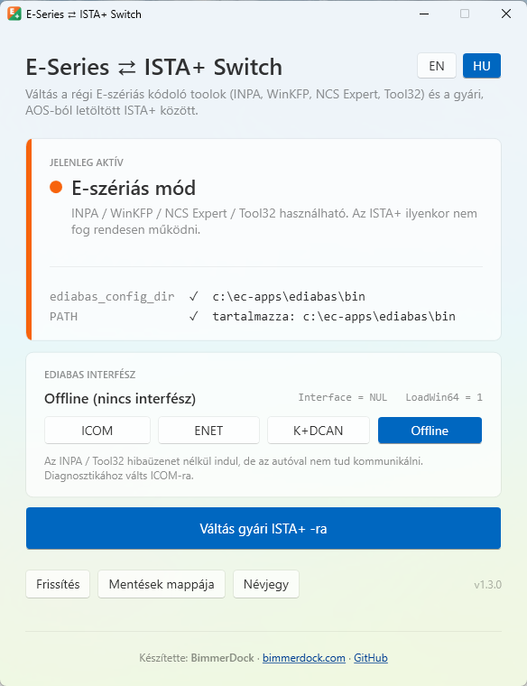

<p align="center">
  
</p>

<h1 align="center">E-Series ⇄ ISTA+ Switch</h1>

<p align="center">
  <b>Egy kattintással válthatsz ugyanazon a Windowsos gépen a régi BMW E-szériás kódoló toolok és a gyári BMW ISTA+ között.</b>
</p>

<p align="center">
  Készítette: <a href="https://bimmerdock.com"><b>BimmerDock</b></a> · <a href="https://bimmerdock.com">bimmerdock.com</a>
</p>

<p align="center">
  🇬🇧 <a href="README.md">English README</a>
</p>

<p align="center">
  
</p>

---

## A probléma

Sok BMW-szerelő és hobbista ugyanazon a laptopon használja mindkét diagnosztikai rendszert:

| | Régi „Standard Tools” | Gyári ISTA+ |
|---|---|---|
| **Programok** | EDIABAS, INPA, WinKFP, NCS Expert, Tool32 | ISTA+ (ISTA-D), a BMW AOS-ból (Aftersales Online System) letöltve |
| **Mire való** | **E-szériás** BMW-k diagnosztikája, kódolása és programozása (nagyjából a '90-es évek végétől a 2010-es évek közepéig, pl. E39, E46, E60/E61, E65, E70, E81–E88, E90–E93), valamint az ugyanebből a korszakból származó **R-szériás MINI-k** | A BMW hivatalos szervizdiagnosztikája E, F, G és újabb szériákhoz |
| **Mit igényel** | EDIABAS a **rendszer környezeti változóiban**: az `EDIABAS_CONFIG_DIR` változó és az EDIABAS `BIN` mappa a `PATH`-ban | **Ne** legyen rendszerszintű EDIABAS a környezeti változókban. Az ISTA+ saját EDIABAS-t hoz magával, és a globális zavarja |

A régi toolok tehát csak **a környezeti változókkal** működnek, az ISTA+ pedig csak **nélkülük** működik megbízhatóan. Eddig ezért minden autócserénél kézzel kellett átírni a rendszerváltozókat, vagy le kellett futtatni egy `.bat` szkriptet.

Az **ESeriesSwitch** ezt egy kattintással, biztonságosan elvégzi, és egy pillantással látod, melyik mód aktív.

> A régi toolok pontos típuslefedettsége az adatfájlok (SP-Daten) verziójától függ. F, G, I és U szériás autókhoz általában E-Sys vagy ISTA+ kell, így erre a programra csak akkor van szükséged, ha a régi toolokat is használod.

## Funkciók

- **Egyértelmű állapotjelzés**: 🟠 *E-szériás mód*, 🟢 *Gyári ISTA+ mód* vagy 🔴 *Részleges állapot* (a két beállításból csak az egyik van meg).
- **Váltás egy kattintással**, mindkét irányba.
- **Automatikus mentés** az előző értékekről minden módosítás előtt.
- **Biztonságos PATH-kezelés**: csak az EDIABAS-bejegyzést adja hozzá vagy veszi ki. A `PATH` többi része és a registry-típusa (`REG_EXPAND_SZ`) érintetlen marad, így a `%SystemRoot%\system32`-höz hasonló bejegyzések továbbra is működnek.
- **EDIABAS interfész kiválasztása** (ICOM, ENET, K+DCAN vagy Offline), az ICOM IP-címe, az ENET cím és a K+DCAN COM port az appban szerkeszthető. Az Offline megelőzi a `NET-0009: TIMEOUT` hibát, ha nincs ICOM csatlakoztatva ([részletek lent](#ediabas-interfész-icom--enet--kdcan--offline)).
- **Újraindítás felajánlása** váltás után.
- **Figyelmeztetés**, ha hiányzik az EDIABAS mappa, vagy ha felhasználói szintű változók felülírhatják a rendszerszintűeket.
- **Angol és magyar** felület, bármikor átváltható.
- **Értesítés új verzióról**: indításkor az app megnézi a GitHubon, van-e újabb kiadás, és ha van, *Letöltés* gombot mutat.
- **Egyetlen hordozható `.exe`**. Nem kell telepíteni, és .NET sem kell hozzá.

## Követelmények

- Windows 10 vagy 11 (64 bites)
- Rendszergazdai jog. Az app rendszerszintű környezeti változókat módosít, ezért indításkor a Windows engedélyt kér (UAC).
- Meglévő EDIABAS-telepítés a régi toolokhoz, a `C:\EC-APPS\EDIABAS\BIN` vagy a `C:\EDIABAS\BIN` mappában

Tesztelve: Windows 11, EDIABAS 7.6.0, BMW AOS-ból letöltött ISTA+ és ICOM Next.

## Letöltés és használat

1. Töltsd le az `ESeriesSwitch.exe`-t a [**Releases**](https://github.com/BimmerDock/ESeriesSwitch/releases) oldalról.
2. Tedd bárhova (Asztal, tools mappa vagy pendrive), és indítsd el. Hagyd jóvá a UAC-kérést.
3. Az állapotkártyán látod, melyik mód aktív.
4. Kattints a **Váltás E-szériás toolokra** vagy a **Váltás gyári ISTA+ -ra** gombra.
5. Ha az app felajánlja, indítsd újra a gépet. Az újonnan indított programok általában azonnal látják a változást, de az újraindítás biztosítja, hogy minden program és háttérszolgáltatás (főleg az ISTA+) átvegye.

> **Windows SmartScreen:** az első indításnál figyelmeztethet, mert az exe nincs digitálisan aláírva. Kattints a *További információ* → *Futtatás mindenképp* lehetőségre.

## Hogyan működik?

Az app a rendszer környezeti változóit módosítja a registryben:
`HKEY_LOCAL_MACHINE\SYSTEM\CurrentControlSet\Control\Session Manager\Environment`

| Mód | `EDIABAS_CONFIG_DIR` | `PATH` |
|---|---|---|
| **E-szériás toolok** | az EDIABAS `BIN` mappára állítja | az EDIABAS `BIN` mappát a végére fűzi |
| **Gyári ISTA+** | törli | minden ismert EDIABAS `BIN` bejegyzést kivesz |

**Melyik EDIABAS mappát használja:**
1. A meglévő `EDIABAS_CONFIG_DIR` változóban lévő mappát, ha az létezik
2. Különben a `c:\ec-apps\ediabas\bin` mappát, ha létezik
3. Különben a `C:\EDIABAS\BIN` mappát

**Minden váltásnál:**
1. JSON-fájlba menti a jelenlegi `PATH`-t (a registry-típusával együtt) és az `EDIABAS_CONFIG_DIR` értékét.
2. Csak a fenti két értéket módosítja.
3. Kiküld egy `WM_SETTINGCHANGE` („Environment”) értesítést, hogy az Explorer és az újonnan indított programok megkapják az új értékeket.
4. Felajánlja az újraindítást.

A Windowsban a környezeti változók nevei és az útvonalak nem kis- és nagybetűérzékenyek. A változót `ediabas_config_dir` néven írja az app, ez ugyanaz a változó, mint az `EDIABAS_CONFIG_DIR`.

## EDIABAS interfész (ICOM / ENET / K+DCAN / Offline)

Az `EDIABAS.INI` `Interface` sora határozza meg, milyen diagnosztikai interfészt használjon az EDIABAS. ICOM-hoz ez `RPLUS:ICOM_P`. Ilyenkor **az INPA és a Tool32 már indításkor az ICOM-ot keresi**. Ha nincs ICOM csatlakoztatva, kb. 20 másodperc után ezt a hibát kapod:

```
ApiInit: Error #159
NET-0009: TIMEOUT
API initialization error
```

Az *EDIABAS interfész* kártya mutatja a jelenlegi beállítást (mindig frissen, közvetlenül az INI-fájlokból olvasva), és egy kattintással átváltja:

| Gomb | `Interface` | `LoadWin64` | Mikor használd |
|---|---|---|---|
| **ICOM** | `RPLUS:ICOM_P` | `1` | E-szériás autókhoz ICOM-mal (INPA, Tool32, NCS Expert). Előbb foglald le az ICOM-ot az **ITool Radarban** |
| **ENET** | `ENET` | `1` | F/G szériás autókhoz (pl. INPA64 / Tool64), ENET kábellel vagy ICOM Next-tel |
| **K+DCAN** | `STD:OBD` | `0` | E-szériás autókhoz K+DCAN USB kábellel. Az Eszközkezelőben állítsd a port késleltetését (latency) **1 ms**-ra |
| **Offline** | `NUL` | nem változik | Nincs interfész csatlakoztatva. Az INPA / Tool32 hibaüzenet nélkül indul, de nem kommunikál az autóval |

A `LoadWin64` (`EDIABAS.INI` → `[Configuration]`) választja ki a 64 bites (`1`) vagy a 32 bites (`0`) EDIABAS-t. Az app az interfésszel együtt ezt is beállítja, az EDIABAS 7.7 konfigurációs leírása szerint. Ha nem illik a kiválasztott interfészhez (például kézi módosítás után), a kártya figyelmeztet, és az aktív interfész gombjára újra kattintva javítható.

**ENET kapcsolat:** ENET módban azt is kiválaszthatod, hogyan csatlakozol az autóhoz. Ez az `EDIABAS.INI` → `[XEthernet]` portjait állítja:

| Választás | `ControlPort` | `DiagnosticPort` |
|---|---|---|
| **ENET kábel** | `6811` | `6801` |
| **ICOM Next** | `50161` | `50160` |

**Kapcsolati beállítások:** ICOM, ENET és K+DCAN módban a gombok alatt megjelenik egy mező. Írd be az új értéket, és kattints a **Mentés** gombra (vagy nyomj Entert):

| Mód | Mező | Hol tárolódik | Megengedett értékek |
|---|---|---|---|
| ICOM | ICOM IP-cím | `Rplus.ini` → `[ICOM_P]` → `RemoteHost` | IPv4-cím, pl. `169.254.92.38` (az ITool Radarban látod). A `0.0.0.0` azt jelenti, hogy *nincs beállítva* |
| ENET | Autó / ICOM IP | `EDIABAS.INI` → `[XEthernet]` → `RemoteHost` | `Autodetect` (alapértelmezett), vagy IPv4-cím, pl. ICOM Next esetén az ICOM IP-címe |
| K+DCAN | COM port | `obd.ini` → `[OBD]` → `Port` | `COM1` … `COM256`, pl. `Com3` formában írva |

Mindhárom fájl az EDIABAS `BIN` mappájában van.

> A WinKFP-hez ICOM-B-vel használt MOST interfészt (`RPLUS:MOST_ASYNC`) az app nem kezeli. Ha ez van beállítva, a kártya *Egyéb interfész*-t mutat.

- Az INI-fájlokat az app **csak** akkor módosítja, ha egy interfészgombra vagy a **Mentés** gombra kattintasz. A módváltás soha nem nyúl hozzájuk.
- Csak az adott sor értékét cseréli le. A fájl többi része bájtra pontosan változatlan marad, sort nem ad hozzá és nem töröl.
- Minden módosítás előtt másolatot ment a fájlról a mentések mappájába.
- A változás az INPA vagy a Tool32 következő indításakor lép életbe, újraindítás nem kell hozzá.

## Mit módosít az app, és mihez nem nyúl

**Módosítja:**
- az `EDIABAS_CONFIG_DIR` rendszerváltozót
- az EDIABAS `BIN` bejegyzést a rendszer `PATH`-ban
- az `EDIABAS.INI` `Interface` és `LoadWin64` sorát, de **csak** interfészgombra kattintva
- az ENET portokat az `EDIABAS.INI`-ben (`[XEthernet] ControlPort` / `DiagnosticPort`), de **csak** az *ENET kábel* / *ICOM Next* választásakor
- az ICOM címét az `Rplus.ini`-ben (`[ICOM_P] RemoteHost`), az ENET címét az `EDIABAS.INI`-ben (`[XEthernet] RemoteHost`) vagy a K+DCAN COM portját az `obd.ini`-ben (`[OBD] Port`), de **csak** a *Mentés* gombra kattintva

**Létrehozza:**
- a mentésfájlokat és a `settings.json`-t (a választott nyelvvel) itt: `C:\ProgramData\ESeriesSwitch\`

**Soha nem nyúl hozzá:**
- a felhasználói szintű környezeti változókhoz (ezeket csak olvassa, és figyelmeztet)
- az ISTA+-hoz, INPA-hoz, WinKFP-hez, NCS Experthez és ezek fájljaihoz
- az `EDIABAS.INI`, az `Rplus.ini` és az `obd.ini` többi részéhez, valamint a `C:\EC-APPS` többi fájljához
- a hálózati beállításokhoz, az ICOM-hoz és a Windows-szolgáltatásokhoz

**Hálózat:** az app egyetlen hálózati kapcsolata a frissítésellenőrzés. Indításkor egyszer lekérdezi az `api.github.com`-ról a legújabb kiadás verziószámát. Rólad és a gépedről semmilyen adatot nem küld, és semmit nem tölt le magától. Ha a gép offline, az ellenőrzés csendben kimarad.

## Mentések és visszaállítás

A mentések helye: `C:\ProgramData\ESeriesSwitch\Backups\`. A **Mentések mappája** gombbal nyithatod meg.

- `backup_ÉÉÉÉHHNN_ÓÓPPMM.json`: a környezeti változók állapota **a váltás előtt**: `Path`, `PathKind`, `EdiabasConfigDir`.
- `EDIABAS_…`, `Rplus_…` és `obd_ÉÉÉÉHHNN_ÓÓPPMM.ini`: a fájl másolata **az interfész vagy egy kapcsolati beállítás módosítása előtt**.

**A környezeti változók kézi visszaállítása:**
1. Nyisd meg a *Rendszer tulajdonságai* → *Környezeti változók…* ablakot (vagy futtasd rendszergazdaként a `rundll32 sysdm.cpl,EditEnvironmentVariables` parancsot).
2. A *Rendszerváltozók* között szerkeszd a `Path` értékét: kattints a *Szöveg szerkesztése…* gombra, és illeszd be a mentésfájl `Path` értékét.
3. Állítsd be vagy töröld az `EDIABAS_CONFIG_DIR` változót a mentésben lévő `EdiabasConfigDir` szerint.

**Az `EDIABAS.INI` / `Rplus.ini` / `obd.ini` kézi visszaállítása:** másold vissza a mentett fájlt az EDIABAS `BIN` mappába, és nevezd át az eredeti nevére.

## Hibaelhárítás

| Tünet | Ok és megoldás |
|---|---|
| `NET-0009: TIMEOUT` az INPA / Tool32 indításakor | Az EDIABAS ICOM-ra van állítva, de nincs ICOM csatlakoztatva, vagy az ISTA+ még lefoglalva tartja. Csatlakoztasd az ICOM-ot (gyújtás ráadva), és ellenőrizd, hogy az **ICOM IP-cím** egyezik-e az ITool Radarban látottal, vagy kattints az **Offline** gombra. Ha előtte ISTA+-t használtál, oldd fel az ICOM foglalását az ITool Radarban, vagy húzd ki kb. 10 másodpercre. |
| Az ISTA+ hibásan működik az ISTA+ módra váltás után | Indítsd újra a gépet, hogy minden folyamat és szolgáltatás a tiszta környezettel induljon. |
| Egy tool még a régi beállítást látja | A már futó programok a régi környezetet tartják meg. Indítsd újra a programot vagy a gépet. |
| Figyelmeztetés a felhasználói változókról | Az `EDIABAS_CONFIG_DIR` vagy az EDIABAS mappa a **felhasználói** változók között is szerepel, és felülírhatja a rendszerszintűt. Töröld kézzel: *Környezeti változók* → *Felhasználói változók*. |

## Fordítás forráskódból

- Visual Studio 2026 („.NET desktop development” csomaggal) vagy .NET 10 SDK
- WPF, .NET 10, C#

```bash
git clone https://github.com/BimmerDock/ESeriesSwitch.git
cd ESeriesSwitch
dotnet build
```

Egyetlen, önálló exe készítése (a kimenet: `bin\publish\ESeriesSwitch.exe`):

```bash
dotnet publish -p:PublishProfile=FolderProfile
```

Visual Studióban: jobb klikk a projekten → **Publish…** → **FolderProfile** → **Publish**.
Az app rendszergazdai jogot igényel, ezért F5-tel debugoláshoz rendszergazdaként indítsd a Visual Studiót.

## Felelősségkizárás

> **A program használata kizárólag saját felelősségre történik.**
>
> A program „ahogy van” alapon, mindennemű kifejezett vagy hallgatólagos garancia nélkül érhető el. A BimmerDock és a közreműködők **semmilyen felelősséget nem vállalnak** a program használatából vagy helytelen használatából eredő közvetlen vagy közvetett károkért. Ide tartoznak többek között a járművekben, vezérlőegységekben (ECU), diagnosztikai interfészekben, számítógépekben, szoftvertelepítésekben vagy adatokban keletkező károk, valamint az adatvesztés és a kiesett munkaidő.
>
> A járműveken végzett diagnosztikai, kódolási és programozási műveletek hibás végrehajtás esetén véglegesen károsíthatják a vezérlőegységeket. Ez a program csak Windows-beállításokat módosít, de a te felelősséged tudni, mit csinálnak az utána futtatott diagnosztikai programok. Mindig készíts saját mentést.

## Védjegyek

Ez a projekt független, nem hivatalos program. **Nem kapcsolódik a BMW AG-hez** vagy leányvállalataihoz, és azok nem támogatják, nem szponzorálják és nem hagyják jóvá.
A BMW, MINI, ISTA, INPA, WinKFP, NCS Expert, EDIABAS, ICOM és AOS nevek a jogtulajdonosaik védjegyei vagy terméknevei. Itt kizárólag azonosítási célból szerepelnek.
A tároló **nem** tartalmaz BMW-szoftvert, adatfájlokat vagy más, jogvédett anyagot.

## Licenc

[MIT](LICENSE) © 2026 [BimmerDock](https://bimmerdock.com). A licenc hivatalos szövege angol nyelvű.

## Verziók

- **1.3.0**
  - Bővített interfészválasztás: ICOM, ENET, K+DCAN és Offline
  - Az ICOM IP-címe (`Rplus.ini`), az ENET cím (`EDIABAS.INI`) és a K+DCAN COM port (`obd.ini`) az appban szerkeszthető, mindig frissen az INI-fájlokból olvasva
  - A `LoadWin64` automatikusan az interfésszel együtt állítódik (ICOM / ENET: 1, K+DCAN: 0), eltérés esetén figyelmeztetéssel
  - ENET kapcsolat választása: ENET kábel (6811 / 6801-es portok) vagy ICOM Next (50161 / 50160-as portok)
  - Beállítási tippek minden interfészhez (ITool Radar foglalás, 1 ms latency a K+DCAN-hez)
  - Az INI-fájlok mentése mindig az eredeti állapotot őrzi meg, akkor is, ha egy művelet több sort módosít
  - Lekerekített választógombok a nyelvhez és az interfészhez
- **1.2.1**: átkerült a [BimmerDock](https://github.com/BimmerDock) organization alá, BimmerDock megjelenés és weboldal-link az appban
- **1.2.0**: értesítés, ha újabb kiadás érhető el a GitHubon
- **1.1.0**
  - Angol és magyar felület, nyelvváltóval
  - Az EDIABAS mappa automatikus felismerése (`c:\ec-apps\ediabas\bin` vagy `C:\EDIABAS\BIN`)
  - ISTA+-ra váltáskor minden ismert EDIABAS-bejegyzés kikerül a `PATH`-ból
  - Névjegy ablak a licenccel és a felelősségkizárással
- **1.0.1**: EDIABAS interfész (ICOM / Offline) kijelzése és váltása
- **1.0.0**: első verzió, váltás az E-szériás toolok és az ISTA+ között
